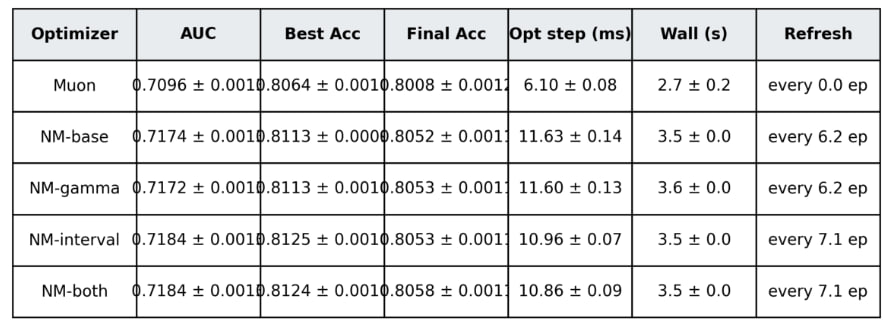
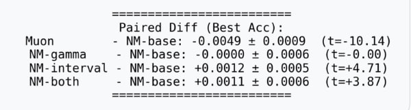
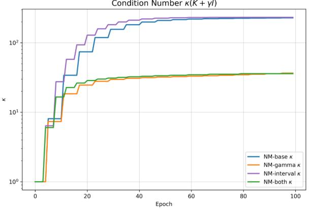
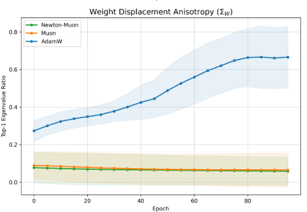
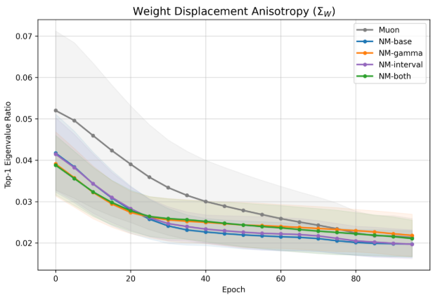
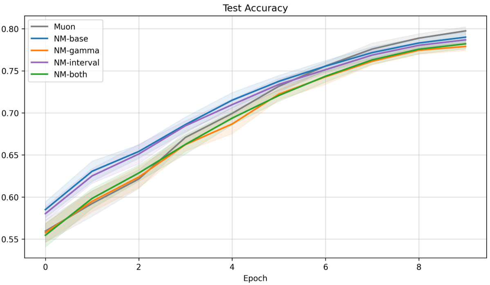
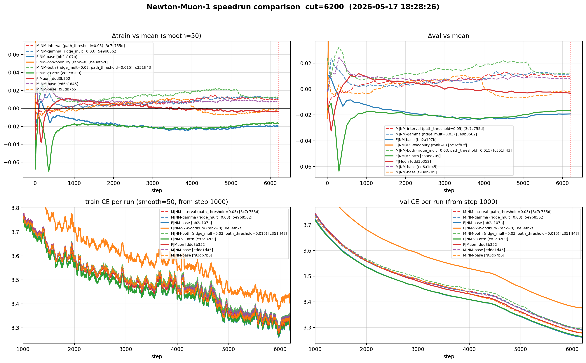
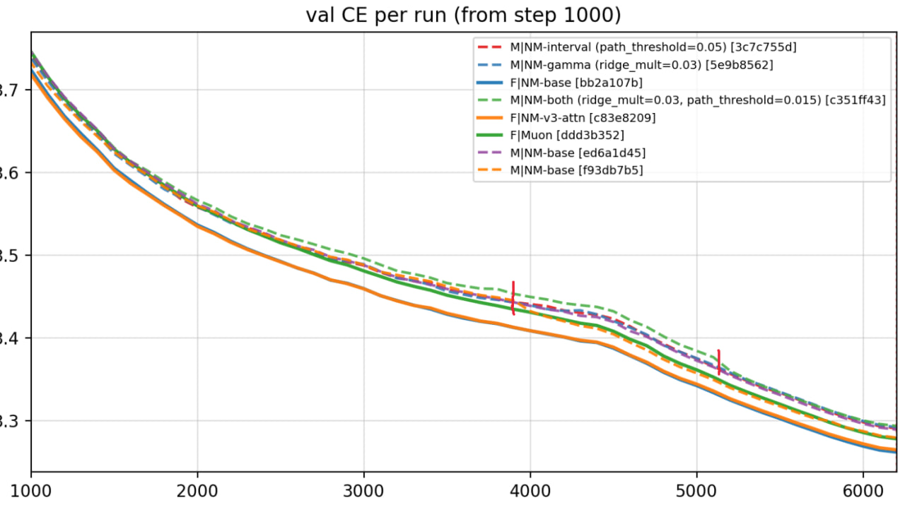
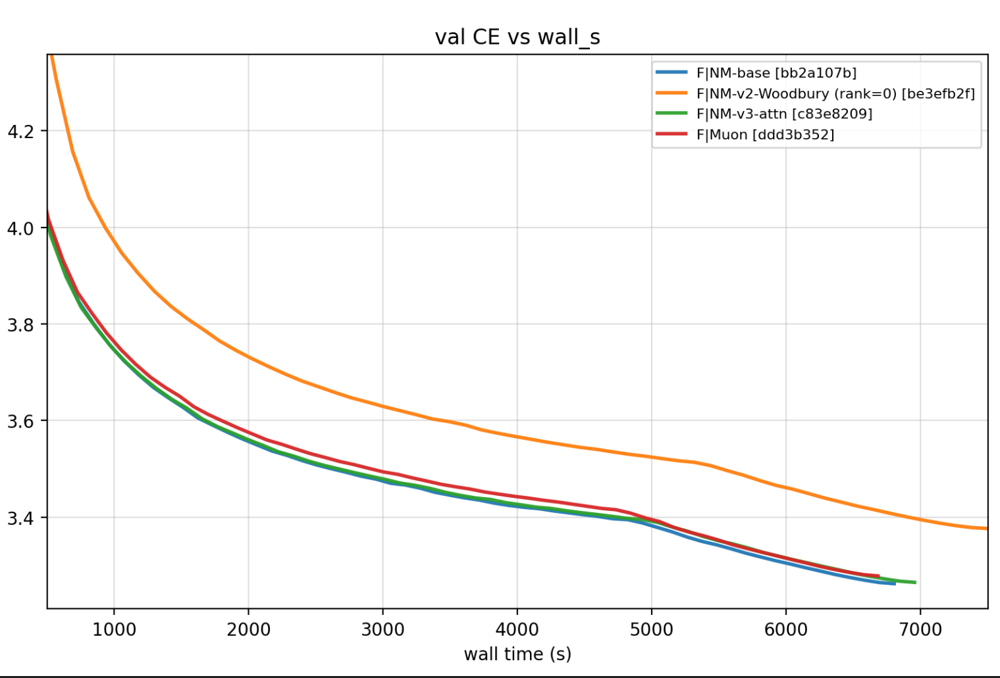
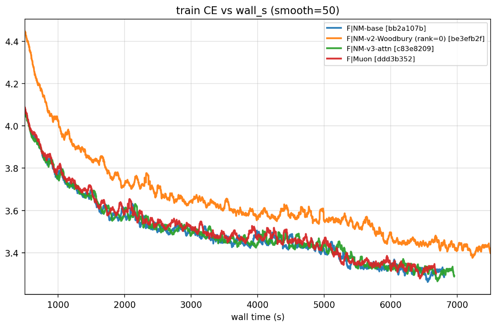

# newton-muon-testing

Реализация **Newton-Muon** оптимизатора из статьи [arXiv:2604.01472](https://arxiv.org/abs/2604.01472) и проверка его на трёх архитектурах (GNN, маленькая CNN, мини-трансформер), плюс две собственные модификации преобуславливателя:

- **`new_gamma`** — Frobenius-norm damping вместо trace-based:
  `ridge = nm_gamma · ‖K‖_F / √d`  (вместо авторского `nm_gamma · trace(K)/d`).
- **`new_interval`** — path-based refresh: пересчитывать preconditioner когда накопленный путь `∑lr` пересёк порог `path_threshold`, а не каждые `N` фиксированных шагов. На расписаниях с спадом lr это естественным образом делает refresh реже к концу обучения.

Дополнительно — модифицированный авторский [код для GPT-2 nanogpt-speedrun](gpt-speedrun/) с этими опциями.

## Структура репозитория

```
src-other/         # экспериментальные скрипты для GNN / CNN / mini-transformer
  optimizers.py        — оригинальная имплементация Newton-Muon
  optimizers_new.py    — наша версия с флагами new_gamma / new_interval
  train_gnn.py         — GNN baseline (Newton-Muon paper-style)
  train_experimental.py — GNN ablation 5 арм (Muon + 4 NM-варианта)
  train_cnn.py         — мини-CNN на CIFAR-10
  train_transformer.py — мини-трансформер на WikiText-2 byte-level

gpt-speedrun/      # авторский Newton-Muon-1 + наши модификации
  train_gpt_newton_muon_1.py        — оригинал
  train_gpt_newton_muon_1_gamma.py  — наш NM-gamma (Frob damping)
  train_gpt_newton_muon_1_interval.py — наш NM-interval (path refresh)
  train_gpt_newton_muon_1_both.py   — обе оптимизации
  triton_kernels.py                 — авторские Triton-ядра
  watch_speedrun.py                 — наблюдатель прогонов, рисует графики
  logs/                              — собранные логи (мои + друга на чистой H200)

final_images/      # итоговые графики
```

## Базовые наблюдения

### GNN (5-слойная GCN, Cora, 150 сидов)

Полный ablation: `Muon` vs `NM-base` vs `NM-gamma` vs `NM-interval` vs `NM-both`.





- `NM-base` лучше чистого Muon на **+0.5%** Best Acc (Muon − NM-base = −0.0049, t=−10.14) — preconditioner реально помогает на GNN.
- `NM-base` и `NM-gamma` совпадают по качеству — Frob ≈ trace, как и ожидалось при правильном scaling.
- `NM-interval` и `NM-both` дают статзначимый прирост над `NM-base` **на агрессивном lr-расписании** (cosine, `eta_min=0.01·lr`): `NM-interval − NM-base = +0.0012, t=+4.71`; `NM-both = +0.0011, t=+3.87`.
- **Синергия:** на default расписании одиночные `new_gamma`/`new_interval` нейтральны, а совместно дают t≈3.6. То есть две модификации не независимы — Frob-damping страхует preconditioner от устаревшей K, которая возникает при редком refresh.

Подтверждается тем что preconditioner действительно сжимает обусловленность K:



И сильно меняет анизотропию весов — Newton-Muon заметно ближе к Muon чем AdamW в направлении изотропных обновлений:



Между NM-вариантами разница в анизотропии тонкая, но направленная — NM-both/interval чуть менее «жадные» по направлению:



### CIFAR-10 small CNN (12 сидов × 10 эпох, width=64)



5-арм ablation по test accuracy. Muon — лучший, NM-варианты идут плотно ниже.

Paired diff (12 сидов, vs NM-base):
- `Muon − NM-base = +0.0075 ± 0.0042` (t=+3.47) → Muon **лучше** NM-base
- `NM-gamma − NM-base = −0.0108 ± 0.0045` (t=−4.67) → хуже всех
- `NM-interval − NM-base = −0.0032 ± 0.0032` (t=−1.95)
- `NM-both − NM-base = −0.0079 ± 0.0037` (t=−4.15)

Вывод: на простой CNN с быстрой сходимостью preconditioner-условия не выполнены (K хаотично меняется со сменой батча), и наши «гладящие» оптимизации только усугубляют.

### Mini-transformer (WikiText-2, byte-level, dim=128, 2 layers, 1500 шагов)

В этой настройке single-seed Δ оказались **в пределах run-to-run шума** (≈ 0.002-0.003 val_CE):
- `NM-gamma` (γ=0.005) → −0.0026 vs Muon, ≈ NM-base
- `NM-interval` (thr=0.40, refresh ~242 шага) → −0.0024 vs Muon, ≈ NM-base
- `NM-both` → проигрывает NM-base (t=+2.95 на 10 сидах)

То есть «синергия» GNN на трансформере не подтверждается — наши оптимизации становятся независимыми или антагонистичными. Также видно что γ_Frob оптимум сдвигается ~1/6-1/10 от оптимума γ_trace.

### NM-1 nanogpt speedrun (GPT-2 small, 6200 итераций, FineWeb-10B)

9 прогонов: 4 моих на shared H200 (трапециевидный scheduler) + 4 чистых от друга и 1 v2 (Woodbury+SVD).

#### Полная картина (наш scaling, без Woodbury в mean/y-axis)



2×2: вверху — Δ от среднего (без NM-v2-Woodbury), внизу — абсолютные кривые с шага 1000. **F** — clean прогоны друга (сплошные), **M** — мои на загруженной H200 (пунктир).

Прогон NM-v2-Woodbury (`be3efb2f`, оранжевый) сильно отстаёт — высокий аппроксимационный bias из ранга=256 + agressive refresh каждые 8 шагов. Он рисуется на графике, но **не учитывается** ни в подсчёте среднего, ни в y-автоскейле.

#### Zoom: val CE per run (со шага 1000)



Видны два «dive'а» (около step 4000 и 5100) у разных прогонов NM-base, не совпадающих с warmdown — это, скорее всего, не-зафиксированный `torch.manual_seed` и стохастика порядка батчей FineWeb. Эти ступеньки одного порядка с наблюдаемым Δ между методами, что делает single-seed выводы ненадёжными.

#### Сравнение по wall-time (только clean прогоны друга)





На чистой H200 без contention:
- `Muon`, `NM-base`, `NM-v3-attn` сходятся к val ≈ 3.27 в ~7000s (соответствует авторскому ориентиру 3.2611).
- `NM-v2-Woodbury` явно проигрывает по обоим метрикам — низкоранговая аппроксимация и слишком частый refresh оба контрпродуктивны.
- `NM-v3-attn` визуально совпадает с `NM-base` — внимание-взвешенная ковариация на этой задаче не даёт прироста.

## Итог по оптимизациям

| | GNN | CNN | mini-trans | NM-1 speedrun |
|---|---|---|---|---|
| `NM-base` | **+** | − | ≈ | **+** (как у авторов) |
| `NM-gamma` | ≈ NM-base | хуже | ≈ NM-base | в пределах шума |
| `NM-interval` | **+** (особенно agressive lr) | хуже | ≈ NM-base | в пределах шума |
| `NM-both` | **+** (синергия!) | хуже всего | хуже NM-base | в пределах шума |

**Вывод:** наши оптимизации работают только там где сам Newton-Muon-preconditioner приносит пользу (GNN), и только в режиме «спокойного» расписания где K успевает стабилизироваться. На задачах где preconditioner нейтрален/вреден они не дают ничего или усиливают деградацию.

## Запуск экспериментов

```bash
# GNN ablation 4-арм
python src-other/train_experimental.py --seeds 150 --epochs 100

# CNN
python src-other/train_cnn.py --seeds 12 --epochs 10 --gpus 0,1,2,3,4

# mini-trans
python src-other/train_transformer.py --seeds 10 --steps 1500 --gpus 0,1,2,3,4

# NM-1 (требует ≥80GB GPU и предварительной загрузки FineWeb-10B):
cd gpt-speedrun
python data/cached_fineweb10B.py 50
tmux new -s nm-gamma
python train_gpt_newton_muon_1_gamma.py 2>&1 | tee logs/nm_gamma.txt

# мониторинг логов NM-1 и финальные графики:
python gpt-speedrun/watch_speedrun.py --logs gpt-speedrun/logs --out compare.png --interval 60
```
